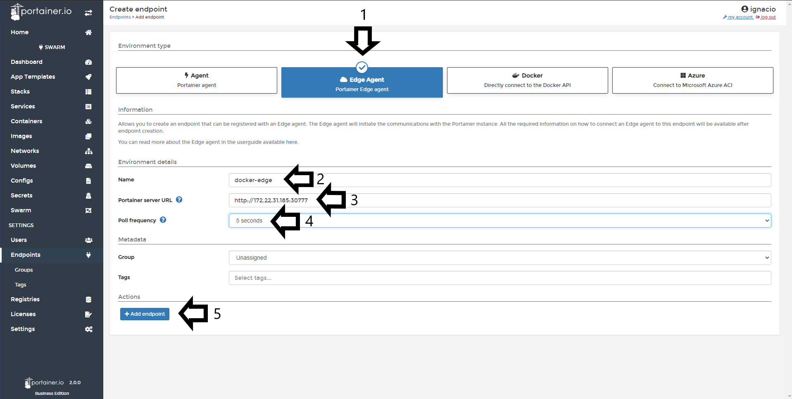
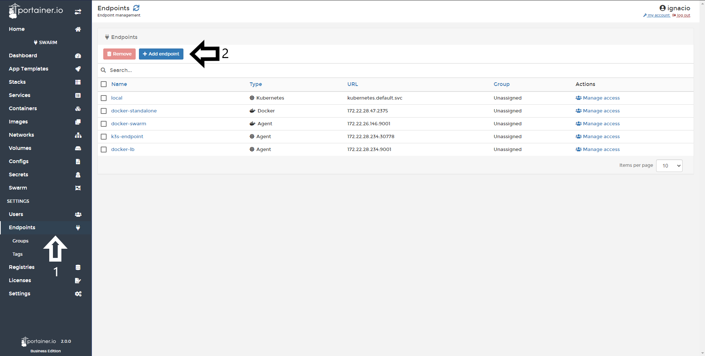
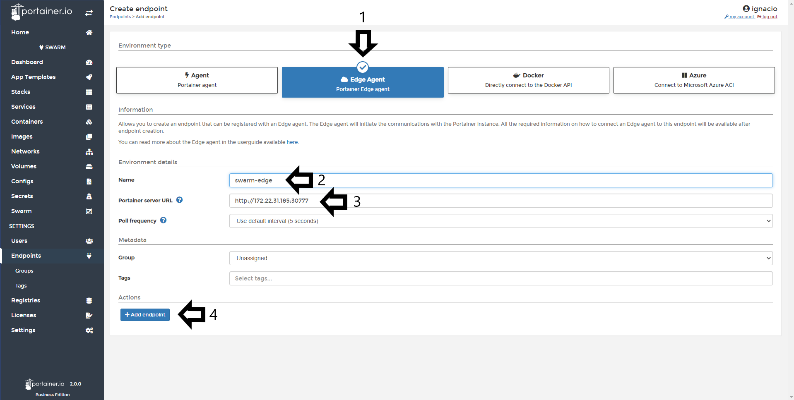
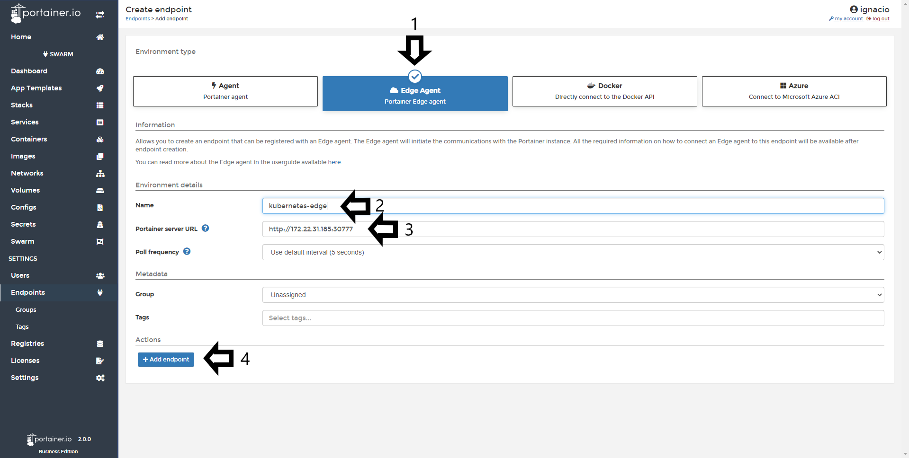
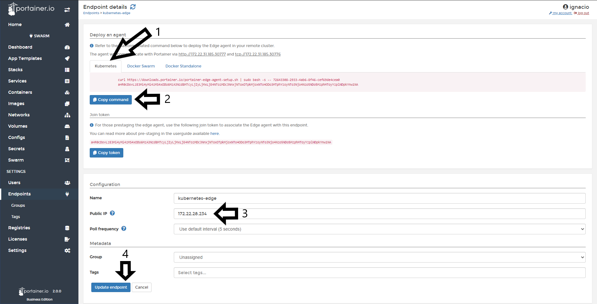

# Add Edge Endpoint.

The edge agent was created as a way to manage an edge compute environment where devices typically lack the networking capability to run the traditional Portainer agent.

### Expose port 8000.

This scenario only applies when Portainer is running in a Docker or Docker Swarm environment.

Portainer communicates with the edge agent over port 8000; through this port the edge agent can poll the Portainer instance, connect to Portainer, see when it is needed & initiate a tunnel or receive config updates. Without port 8000 exposed on Portainer, you cannot access the edge endpoint. If you already have Portainer deployed, you need to redeploy with port 8000 exposed alongside the port used to access Portainer.
Using the CLI flag --tunnel-port you are able to set a different port if 8000 is already in use. For more information see [CLI options](/v2.0-be/deploy/cli.md).

## Recommended Portainer deployment methods.

* Portainer with TLS: If your Portainer instance is deployed with TLS, the agent will use HTTPS for the connection it makes back to Portainer. This is the recommended approach.
* Portainer with self-signed certs: If you are using a self-signed Portainer instance, the edge agent must be deployed with the flag: <code>-e EDGE_INSECURE_POLL=1</code>. If you do not deploy Portainer with this flag, then the agent will not be able to communicate with Portainer. This option is less secure than TLS.
* Portainer fallback to HTTP: If Portainer is not configured with either of the above options, it will fallback to using HTTP for the agent polling. This option is no longer recommended, as it is insecure.

## Deploying Edge agent in Docker Standalone environment.

To add an Edge Endpoint to Portainer: 1. Click <b>Endpoints</b>  2. Click <b>Add Endpoint</b> button.

1. Click <b>Edge Agent</b> 2. Assign <b>friendly name</b> 3. Set the <b>Portainer Server URL</b> indicating the Public IP of your Portainer instance and the <b>port</b> 4. Define a <b>Pull Frequency</b> (default is 5s) and 5. Click <b>Add Endpoint</b>

In the next screen, 1. Select <b>Docker Standalone</b>in the tabbed <b>Information</b> section and then 2. <b>Copy Command</b>

This command needs to be run in the Docker Standalone. Running <code>docker ps</code> should result in something similar to:

<pre><code>CONTAINER ID        IMAGE                            COMMAND             CREATED             STATUS              PORTS                    NAMES
b9e27f356de8        portainer/agent                  "./agent"           12 seconds ago      Up 12 seconds                                portainer_edge_agent</code></pre>

Next, in the <b>Configuration</b> section, 1. Define the <b>IP address</b> of the node you want to manage 2. Click <b>Update Endpoint</b>.

You should then see the following pop up.

## Deploying Edge agent in Docker Swarm environment.

Adding a Docker Swarm environment with Edge Agent is very similar to the scenario with Docker Standalone.

To add an Edge Endpoint to Portainer: 1. Click <b>Endpoints</b>  2. Click <b>Add Endpoint</b> button.

1. Click <b>Edge Agent</b> 2. Assign <b>friendly name</b> 3. Set the <b>Portainer Server URL</b> indicating the Public IP of your Portainer instance and the <b>port</b> 4. Define a <b>Pull Frequency</b> (default is 5s) and 5. Click <b>Add Endpoint</b>

In the next screen, 1. Select <b>Docker Swarm</b>in the tabbed <b>Information</b> section and then 2. <b>Copy Command</b>

Run the command in the <b>Docker Swarm</b> node, expected results should look similar to:

<pre><code>cp2v1mqzkjpcroo3ama8wsve1
overall progress: 1 out of 1 tasks
okei8p76rf6k: running   [==================================================>]
verify: Service converged</code></pre>

Running <code>docker service ls</code> you should see:

<pre><code>ID                  NAME                   MODE                REPLICAS            IMAGE                    PORTS
cp2v1mqzkjpc        portainer_edge_agent   global              1/1                 portainer/agent:latest</code></pre>

Next, in the <b>Configuration</b> section, 1. Define the <b>IP address</b> of the node you want to manage 2. Click <b>Update Endpoint</b>.

You should then see the following pop up:

## Deploying Edge agent in Kubernetes environment.

To add an Edge Endpoint to Portainer: 1. Click <b>Endpoints</b>  2. Click <b>Add Endpoint</b> button.

1. Click <b>Edge Agent</b> 2. Assign <b>friendly name</b> 3. Set the <b>Portainer Server URL</b> indicating the Public IP of your Portainer instance and the <b>port</b> 4. Define a <b>Pull Frequency</b> (default is 5s) and 5. Click <b>Add Endpoint</b>

In the next screen, 1. Select <b>Docker Swarm</b>in the tabbed <b>Information</b> section and then 2. <b>Copy Command</b>.

You need to run this command in the Kubernetes host and the expected results is the following:

<pre><code>  % Total    % Received % Xferd  Average Speed   Time    Time     Time  Current
                                 Dload  Upload   Total   Spent    Left  Speed
100  3190  100  3190    0     0   1249      0  0:00:02  0:00:02 --:--:--  1248
Downloading agent manifest...
  % Total    % Received % Xferd  Average Speed   Time    Time     Time  Current
                                 Dload  Upload   Total   Spent    Left  Speed
100  2070  100  2070    0     0   1582      0  0:00:01  0:00:01 --:--:--  1582
Creating Portainer namespace...
namespace/portainer created
Creating agent configuration...
configmap/portainer-agent-edge-id created
Creating agent secret...
secret/portainer-agent-edge-key created
Deploying agent...
Warning: kubectl apply should be used on resource created by either kubectl create --save-config or kubectl apply
namespace/portainer configured
serviceaccount/portainer-sa-clusteradmin created
clusterrolebinding.rbac.authorization.k8s.io/portainer-crb-clusteradmin unchanged
service/portainer-agent created
deployment.apps/portainer-agent created
Portainer Edge agent successfully deployed</code></pre>

You can validate if the Edge Agent is running in your host executing the following command:

<pre><code> kubectl get pods --namespace=portainer</code></pre>

After running the command, you can enter the IP address of the host and click in <b>Update Endpoint</b> button.

You should then see the following pop up:

||||| SPACE FOR POP UP |||||

## Notes

[Contribute to these docs](https://github.com/portainer/portainer-docs/blob/master/contributing.md){target=_blank}