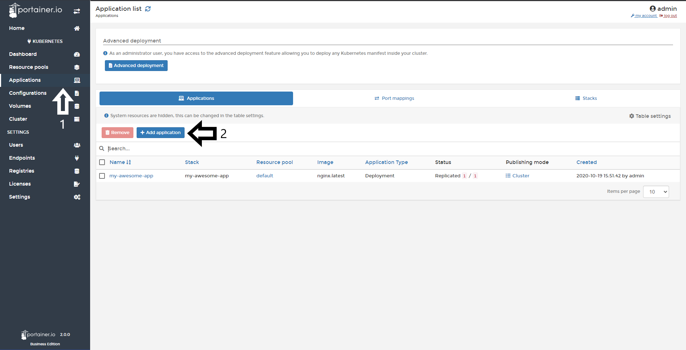
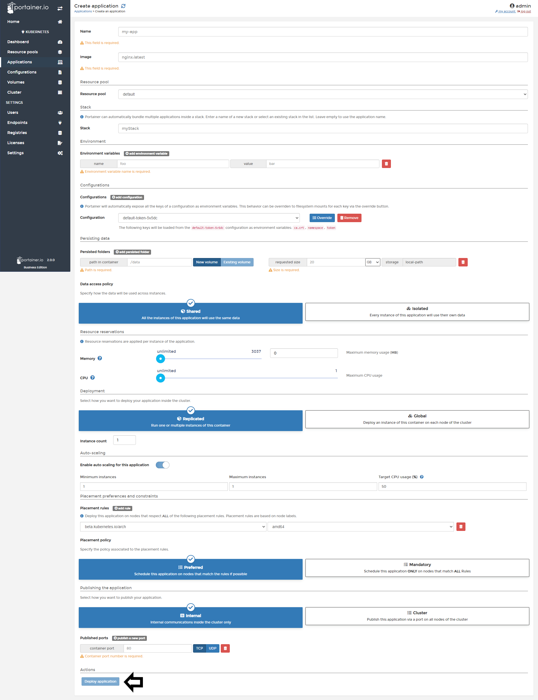

# Deploy New Applications

From Portainer, you can deploy new applications in your Kubernetes cluster without the need to learn complex CLI commands or edit large YML files. In this help article, you will learn how to deploy an App into a Kubernetes cluster using Portainer.

## Deploying an application

Deploying an application in Portainer to Kubernetes is very easy and very customizable depending on your need.

To deploy a new application, click <b>Applications</b> and then <b>Add Application</b>.

After that, you will see a form to complete according to your needs. The options available are:

* Name: Name of your Container.
* Image: This is the image you want to use to deploy your container.
* Resource Pool: This is the namespace where your container is going to live. To add a new resource pool, see this [help article](/v2.0-be/docs/kubernetes/resouce_pool/create.md).
* Stack: Portainer can automatically bundle multiple applications inside a stack. Enter a name of a new stack or select an existing stack in the list. Leave empty to use the application name.
* Environment Variables: Fill the environment that your app needs, this is optional and only depends of the configuration supported by your app.
* Configurations: If you created configuration files before using Portainer, you can select that configuration in this space.
* Persisting Data: Define what folder of the container needs to be persisted. 
* Data Access Policy: Here you need to specify how the data will be used across instances. The options are the following:
  - Shared: All the instances of this application will use the same data.
  - Isolated: Every instance of this application will use their own data.
* Resource Reservations: Define what resources can be used by your application.
* Deployment: Select how you want to deploy your application inside the cluster. The options are the following:
  - Replicated: Run one or multiple instances of this container.
  - Global: Deploy an instance of this container on each node of the cluster.
* Auto Scaling: Select this to enable the auto-scaling of your application and define how many instances need to scale and under what conditions.
* Placement rules: Deploy this application on nodes that respect ALL of the following placement rules. Placement rules are based on node labels.
* Placement Policy: Specify the policy associated to the placement rules. This can be any of two options:
  - Preferred: Schedule this application on nodes that match the rules if possible.
  - Mandatory: Schedule this application ONLY on nodes that match ALL Rules.
* Publish Application: Select how you want to publish your application. This can be one of two options:
  - Internal: Internal communications inside the cluster only.
  - Cluster: Publish this application via a port on all nodes of the cluster.
Publish Ports: Only applicable if you have selected Cluster above.

When everything was set up, click <b>Deploy application</b>.

## Notes

[Contribute to these docs](https://github.com/portainer/portainer-docs/blob/master/contributing.md){target=_blank}