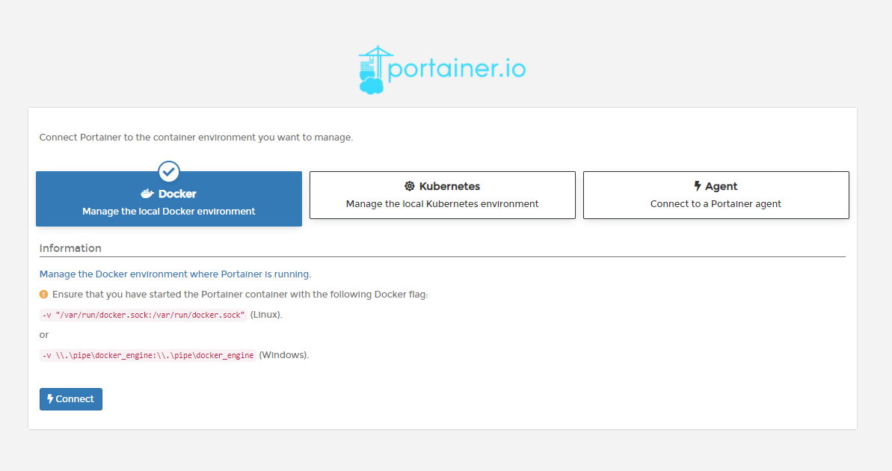

# Initial Set Up

Once Portainer is deployed and you have navigated to http://ip-server:9000, you will see the following screens. 

## Set Password Admin

The first thing to do is set a password for the admin user. This password needs to be at least eight characters long.


The password can also be set up from the command line or from a configuration file:

### From the command line
Portainer allows you to specify a bcrypt encrypted password from the command line for the admin account. You need to generate the bcrypt encrypted password first.

You can generate the encrypted password with the following command:

```
$ htpasswd -nb -B admin  | cut -d ":" -f 2
```

or if your system does not provide htpasswd you can use a docker container with the command:

```
$ docker run --rm httpd:2.4-alpine htpasswd -nbB admin "password" | cut -d ":" -f 2
```
To specify the admin password from the command line, start Portainer with the `--admin-password` flag:

```
$ docker run -d -p 9000:9000 -p 8000:8000 -v /var/run/docker.sock:/var/run/docker.sock portainer/portainer --admin-password='$2y$05$qFHAlNAH0A.6oCDe1/4W.ueCWC/iTfBMXIHBI97QYfMWlMCJ7N.a6'
```

### Inside a file
You can also store the plaintext password inside a file and use the --admin-password-file flag:

```
$ echo -n mypassword > /tmp/portainer_password
$ docker run -d -p 9000:9000 -p 8000:8000 -v /var/run/docker.sock:/var/run/docker.sock -v /tmp/portainer_password:/tmp/portainer_password portainer/portainer --admin-password-file /tmp/portainer_password
```

This works well with Swarm & Docker secrets too:

```
$ echo -n mypassword | docker secret create portainer-pass -
$ docker service create \
  --name portainer \
  --secret portainer-pass \
  --publish 9000:9000 \
  --publish 8000:8000 \
  --replicas=1 \
  --constraint 'node.role == manager' \
  --mount type=bind,src=/var/run/docker.sock,dst=/var/run/docker.sock \
  portainer/portainer \
  --admin-password-file '/run/secrets/portainer-pass' \
  -H unix:///var/run/docker.sock
```

Note: This will automatically create an administrator account called admin with the specified password.

## Collection of statistics

We anonymously collect information about how Portainer is used via a tool called Matomo. You can disable this option, but we recommend leaving it activated. This will help us understand how our users use Portainer and improve it.

You can read more about our privacy policy [here](https://www.portainer.io/documentation/in-app-analytics-and-privacy-policy/)

You can enable or disable this using the checkbox shown:


This can be changed at any time via the Portainer Settings screen

## Connect Portainer to the container environment

If you installed [Portainer in Kubernetes](/v2.0/deploy/linux/#deploy-portainer-in-kubernetes) you would choose Kubernetes, but if you [installed in Docker](/v2.0/deploy/linux/#deploy-portainer-in-docker), you may want choose manage the local Docker environment. 




Once the appropriate option is selected, click connect. If everything works as expected, You will then be shown the Portainer home page.


## Notes

[Contribute to these docs](https://github.com/portainer/portainer-docs/blob/master/contributing.md).
