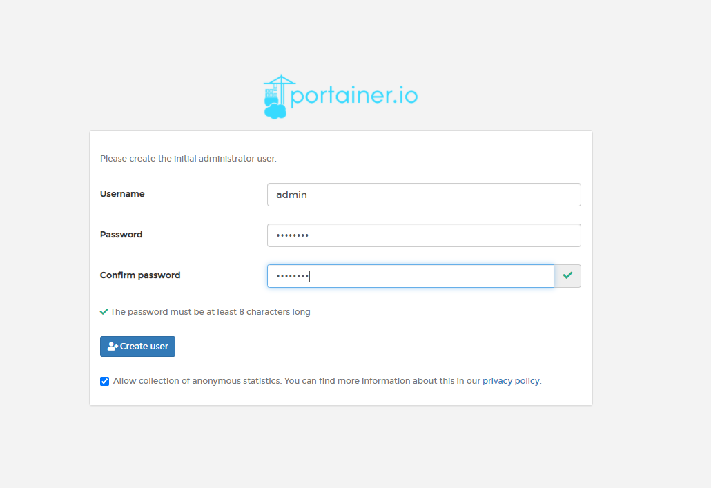
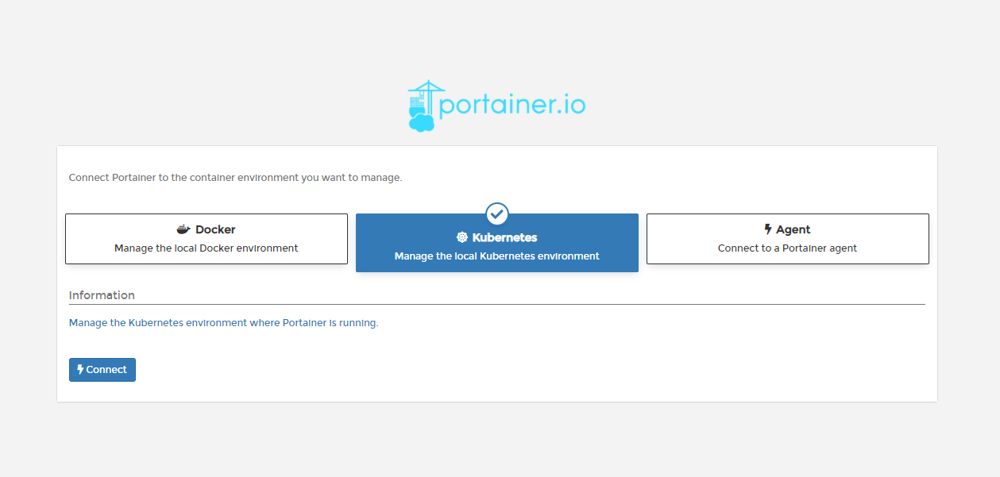
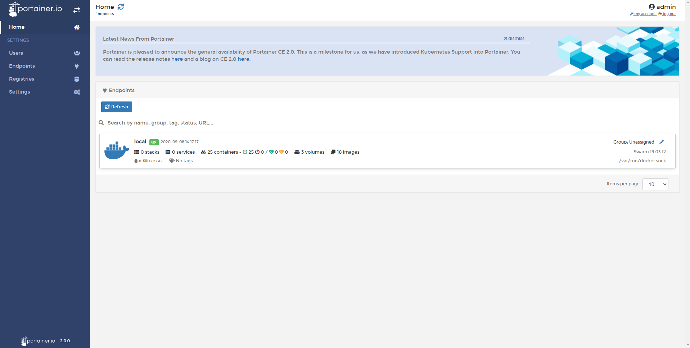

# Initial screen after installation

Once you deploy Portainer and head your browser to http://ip-server:9000, you will see the following screens. 

## Set Password Admin

The first thing to do is set a password for the admin user. This password needs to be at least eight characters long.

## Collection of statics

We anonymously collect information about how Portainer is used. You can disable this option, but we recommend leaving it activated. This will help us understand how our users use Portainer and improve it.

You can read more about our privacy policy [here](https://www.portainer.io/documentation/in-app-analytics-and-privacy-policy/)

You can leave enable or disable doing a click in the checkbox:

## Connect Portainer to the container environment

If you installed [Portainer in Kubernetes](/v2.0/deploy/linux/#deploy-portainer-in-kubernetes) you would choose Kubernetes, but if you [installed in Docker](/v2.0/deploy/linux/#deploy-portainer-in-docker), you may want choose manage the local Docker environment. 

Once that is decided, do a click in connect. If everything works as expected, you will see the Portainer homepage. 

## Notes

Do you think that is missing something here? Contribute with this admin guide forking the repo [Portainer-Docs](https://github.com/portainer/portainer-docs) and propose changes.