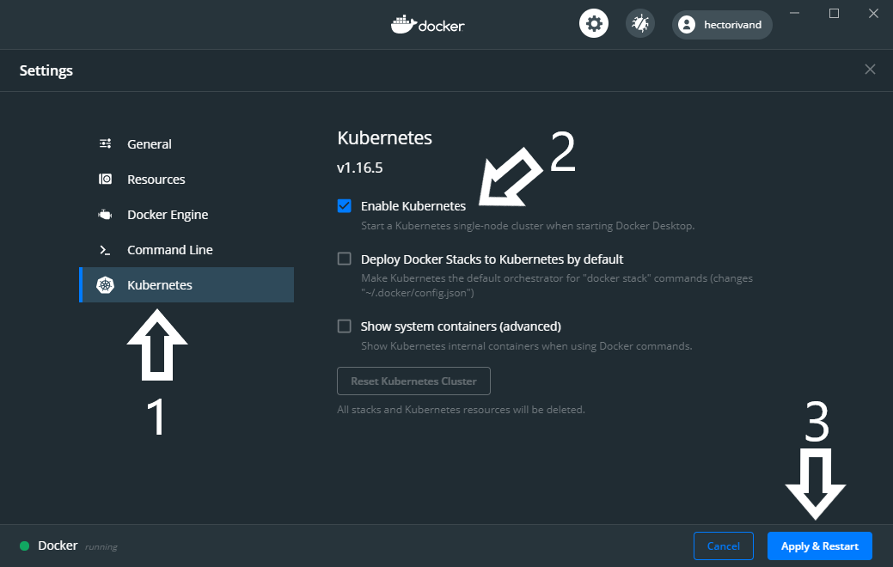

# Deploy Portainer in Windows 10

## Deploy Portainer in Kubernetes trough Docker Desktop. 

You can deploy Portainer in a Kubernetes environment in Windows using Docker Desktop. Note: This scenario is for testing purpose only.

### Enable Kubernetes in Docker Desktop

To enable Kubernetes in Docker Desktop, you need to open the dashboard of Docker Desktop. Do a right click in Docker icon and do a click in "dashboard"

Then, do a click in Settings:

The next thing is do a click in Kubernetes, check the box and do a click in Apply & Restar button. 

Aftter a few minutes, you will see that Kubernetes is running:

### Deploy Portainer using YAML Manifest

First create the Portainer namespace in your cluster

<pre><code>$ kubectl create namespace portainer</code></pre>

#### For NodePort
<pre><code>$ kubectl apply -n portainer -f https://raw.githubusercontent.com/portainer/k8s/master/deploy/manifests/portainer/portainer.yaml</code></pre>

If everything work as expected, you can navigate to Portainer from the browser with the address http://localhost:30777

#### For Load Balancer
<pre><code>kubectl apply -n portainer -f https://raw.githubusercontent.com/portainer/k8s/master/deploy/manifests/portainer/portainer-lb.yaml</code></pre>

## Deploy Portainer in Docker

Portainer is comprised of two elements, the Portainer Server, and the Portainer Agent. Both elements run as lightweight Docker containers on a Docker engine or within a Swarm cluster. Due to the nature of Docker, there are many possible deployment scenarios, however, we have detailed the most common below. Please use the scenario that matches your configuration.

Note that the recommended deployment mode when using Swarm is using the Portainer Agent.

To see the requeriments, please, visit the page of [requirements](v2.0/deploy/requeriments.md)

### Docker Standalone in WSL2

Before start to deploy Portainer in Docker Standalone running in Windows, you need to install WSL. [Read this guide to know more about WSL/WSL2](https://docs.microsoft.com/en-us/windows/wsl/install-win10)

Use the following Docker commands to deploy the Portainer Server; note the agent is not needed on standalone hosts, however it does provide additional functionality if used (see portainer and agent scenario below):

<pre><code>$ docker volume create portainer_data</code></pre>

<pre><code>$ docker run -d -p 8000:8000 -p 9000:9000 --name=portainer --restart=always -v /var/run/docker.sock:/var/run/docker.sock -v portainer_data:/data portainer/portainer-ce</code></pre>

### Docker Swarm in WSL2

Deploying Portainer and the Portainer Agent to manage a Swarm cluster is easy! You can directly deploy Portainer as a service in your Docker cluster. Note that this method will automatically deploy a single instance 
of the Portainer Server, and deploy the Portainer Agent as a global service on every node in your cluster.

Remember to initiate the Docker Swarm mode when you use Docker Desktop. You can do this running the following command:

<pre><code>$ docker swarm init</code></pre>

The terminal will reply with this:

<pre><code>Swarm initialized: current node (15gbf4d66mvzk3die00sgirpf) is now a manager.

To add a worker to this swarm, run the following command:

    docker swarm join --token SWMTKN-1-096qbnf2b9yywagu5ht3731zlpkeqazgctffolntsiljfp0m34-c4snnxplgwq2bd1ohta8k48b9 192.168.65.3:2377

To add a manager to this swarm, run 'docker swarm join-token manager' and follow the instructions.</code></pre>

Once this is done, you can continue with the installation running the following command:

<pre><code>$ curl -L https://downloads.portainer.io/portainer-agent-stack.yml -o portainer-agent-stack.yml</code></pre>
<pre><code>$ docker stack deploy -c portainer-agent-stack.yml portainer</code></pre>

### Notes

Theses deployments was tested in Windows 10 Pro 2004 edition.