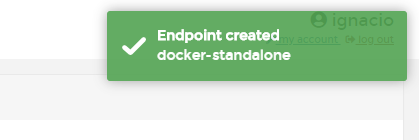
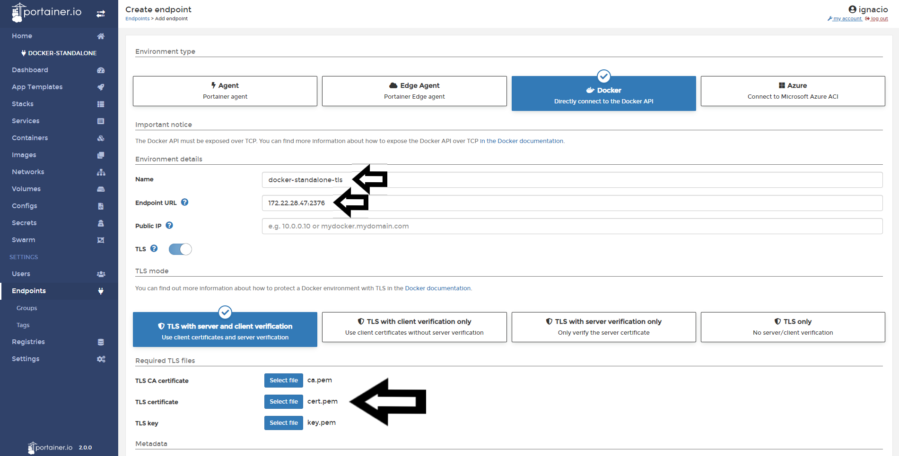

# Add Docker Endpoint

 If you want to manage any standalone Docker Host, you must connect to the Docker API directly. To expose the Docker API to admit remote connections, you need to follow [these steps](https://docs.docker.com/engine/install/linux-postinstall/#configuring-remote-access-with-systemd-unit-file).

Once this is complete we can connect the Docker API with and without TLS.

## Connect to Docker Host API without TLS

1. Go to <b>Endpoints</b> 2. Click <b>Add Endpoint</b>.

The next step is <b>choose the environment</b> type and select <b>Docker</b>. In the following section (Environment Details), you need to specify the following information:

* Name: This a descriptive name that will help you to identify this endpoint in the future.
* Endpoint URL: Is the name or IP address to connect to the Docker Host. Don't forget to specify the port. When you set Docker to use TLS, the default port is <b>2376</b>
* Public IP: URL or IP address where exposed containers will be reachable. This field is optional and will default to the endpoint URL.
* TLS: Enable this option if you need to connect to the Docker endpoint with TLS.

Once all this has been specified, you can click <b>Add Endpoint</b> button

If successful, you will see a pop up confirming that the Endpoint was added successfully:

## Connect to Docker Host API with TLS

Portainer is able to connect to the Docker Host API using TLS. To use this option, the Docker environment must be protected already. You can find out more information about how to protect a Docker environment with TLS in the [Docker documentation](https://docs.docker.com/engine/security/https/)

To connect directly to a Docker host API TLS: 1. Go to <b>Endpoints</b> and 2. Click in the <b>Add Endpoint</b>.

The next step is <b>choose the environment</b> type and select <b>Docker</b>. In the following section (Environment Details), you need to specify the following information:

* Name: Name: This a descriptive name that will help you to identify this endpoint in the future.
* Endpoint URL: Is the name or IP address to connect to the Docker Host. Don't forget to specify the port. 
* Public IP: URL or IP address where exposed containers will be reachable. This field is optional and will default to the endpoint URL.
* TLS: Enable this option if you need to connect to the Docker endpoint with TLS.
* TLS CA Certificate: Define your CA Cerficate.
* TLS Certificate: Define your certificate.
* TLS Key: Define your certificate key.

Once all this has be specified, you can click in the <b>Add Endpoint</b> button. 

Scroll down to the bottom of the page and click <b>Add Endpoint</b>.

## Notes

[Contribute to these docs](https://github.com/portainer/portainer-docs/blob/master/contributing.md){target=_blank}