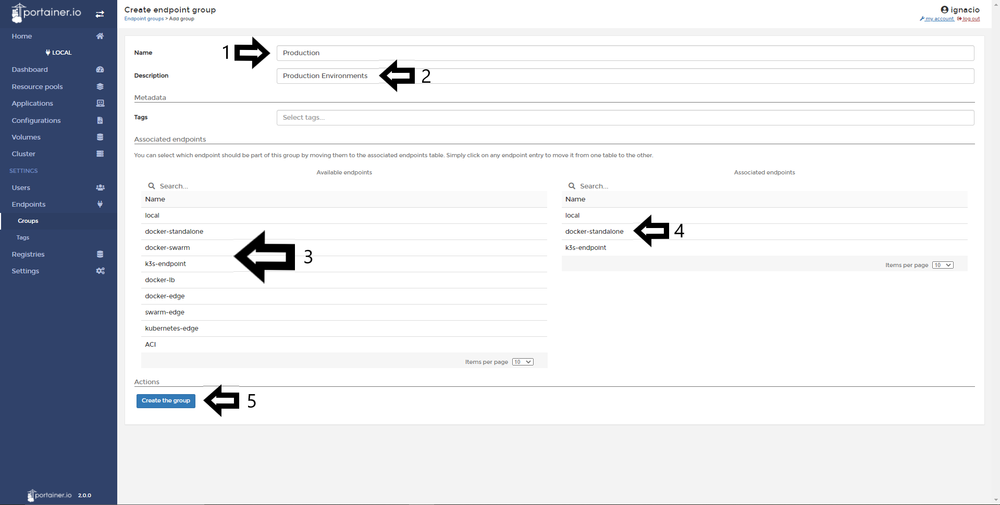
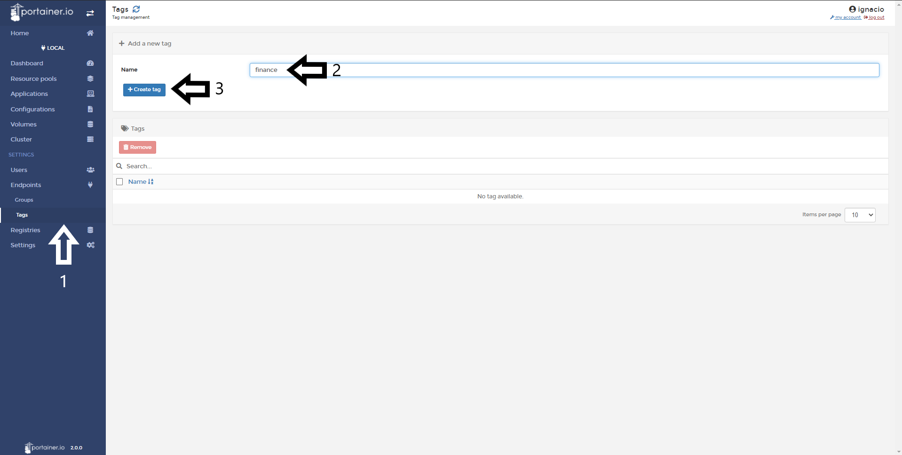

# Endpoints Groups and Endpoint Tags

In Portainer, you will able to set up Groups and Tags to organize your endpoints. For example, you can set up a group for Development, Stage or Production and use the Tags to identify to what departament is "owner" of that resources or where is located.

## Add a Endpoint Group

Adding a Endpoint group is very easy in Portainer. Once you logged to Portainer, do a click in <b>Endpoints</b> and then in <b>Groups</b>

In the next screen, you need to define some things:

1 - Name: Define the name of your group. 
2 - Description: Add a description to your group. (Optional)
3 - Select the endpoints for that group
4 - You will see the endpoints associated to that group. 
5 - Once is defined, do a click in <b>Create The Group.</b>

You can view the groups added, should look like this:

## Add Endpoint Tags

Using tags help you to define metadata about the nodes or resources. For example, if a node is in Los Angeles, you can set a tag to that node to have more visibility when looking for nodes running in Los Angeles. The same concept for department or "owners" of that's resources.

Once you logged to Portainer, do a click in <b>Endpoints</b> and then in <b>Tags</b>. Define a name for your Tag and do a click in <b>Create Tag</b>.

If you create several tags, you will all the tags listed:

### Adding a Tag to an Endpoint

To add a Tag to an Endpoint. Go to <b>Endpoints</b> and select the endpoint you want.

Select the tag you want to assign to that endpoint and then, do a click to <b>Update Endpoint</b>.

After that, you can see in the Home Page, the endpoint with the tags associated.

## Notes

Do you think that is missing something here? Contribute with this admin guide forking the repo [Portainer-Docs](https://github.com/portainer/portainer-docs) and propose changes.