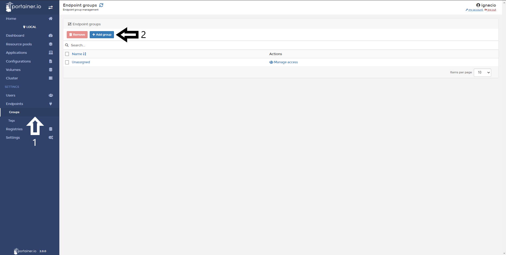
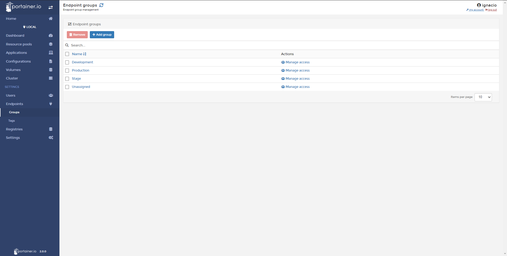
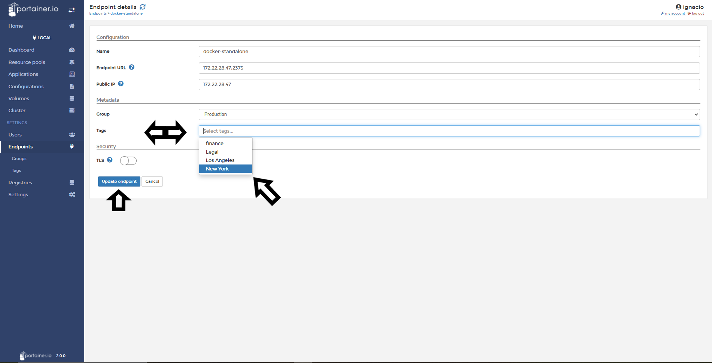

# Endpoints Groups and Endpoint Tags

In Portainer, you will able to set up Groups and Tags to organize your endpoints. For example, you can set up a group for Development, Stage or Production and use the Tags to identify to which department is the resource "owner" or where it is located.

## Add a Endpoint Group

Adding an Endpoint is very easy in Portainer. Once logged in 1. Click <b>Endpoints</b> and then 2. <b>Groups</b>

Next, define the Group:

1 - Name: Define the name of your group. 
2 - Description: Add a description to your group. (Optional)
3 - Select the endpoints for that group
4 - You will see the endpoints associated to that group. 
5 - Once is defined, do a click in <b>Create The Group.</b>

Once groups have been created you should see this:

## Add Endpoint Tags

Use tags to define node or resource metadata. E.g. Add tag "LA" for a node located in Los Angeles, you can set a tag to that node to have more visibility when looking for nodes running in Los Angeles. The same concept for department or "owners" of those resources.

1. Click <b>Endpoints</b> 2. Select <b>Tags</b> 3. Define Tag names and 4. Click <b>Create Tag</b>.

All tags will then be shown in a table:

### Adding a Tag to an Endpoint

To add a Tag to an Endpoint. 1. Go to <b>Endpoints</b> and 2. Select the desired endpoint.

Select the desired tag and click <b>Update Endpoint</b>

Once complete the Home Page shows the Endpoints and their associated tags.

## Notes

Do you think that is missing something here? Contribute with this admin guide forking the repo [Portainer-Docs](https://github.com/portainer/portainer-docs) and propose changes.