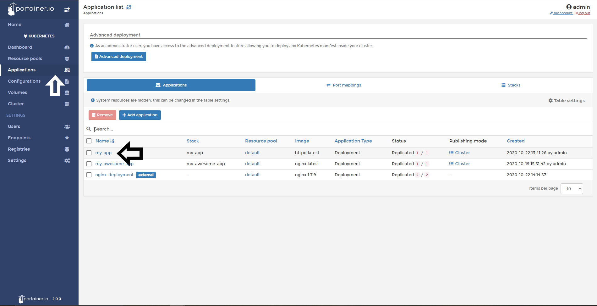

# Inspect Application.

From Portainer, you will able to see a lot of details of your application running in the cluster. In this help article, you will see what information you can found using Portainer.

To access to this information about each container, do a click in <b>Applications</b> and the click in the application you want inspect.

## Application information

In the tab <b>Application</b>, you can found the following information:

* Name: Name of the application.
* Stack: Name of the stack that this container belongs.
* Resource Pool: In what resouce pool / Namespace this application in running.
* Application Type.
* Status: Here, we can see if the application is running.
* Creation: Information about who and when the application was created.

Also, you can find specific configuration of this application:

* Port published: Show what is the port published from this container.
* Auto Scaling: Show if this application has a auto scaling policy defined.
* Configuration: Here, we can see if the application has a special configuration defined.
* Data Persistence: Here we can see what directory are persitent.

In the Application container section you can see the pod that run your application, what the image is using, status, node and information about when was created. Also, you can access to logs or the console of this Pod.

## Placement

In this tab, you will find information about in what node your application is running.

## Events

In this tab, you will find information about the events related of your container.

## YML

In this section, you can find the YML generated from the deplotyment of you application using Portainer. This is very useful to create "backups" of your configuration.

## Notes

[Contribute to these docs](https://github.com/portainer/portainer-docs/blob/master/contributing.md).