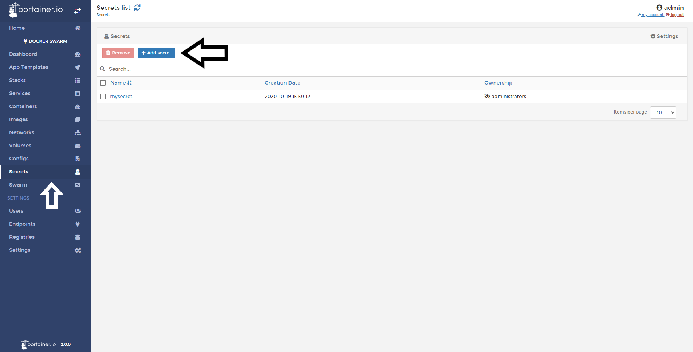

# Add Secrets

In terms of Docker Swarm services, a secret is a blob of data, such as a password, SSH private key, SSL certificate, or another piece of data that should not be transmitted over a network or stored unencrypted in a Dockerfile or in your application’s source code. In Docker 1.13 and higher, you can use Docker secrets to centrally manage this data and securely transmit it to only those containers that need access to it. Secrets are encrypted during transit and at rest in a Docker swarm. A given secret is only accessible to those services which have been granted explicit access to it, and only while those service tasks are running.

You can use secrets to manage any sensitive data which a container needs at runtime but you don’t want to store in the image or in source control, such as:

* Usernames and passwords
* TLS certificates and keys
* SSH keys
* Other important data such as the name of a database or internal server
* Generic strings or binary content (up to 500 kb in size)

## Creating a Secret

To create a secret in Portainer, go to <b>Secrets</b> and click <b>Add Secret</b>.

In the next screen, you need to set a <b>name</b> for you secret, define the <b>'secret'</b>, choose if you need to encode that secret, (this is useful when you set a password in plain text) and click <b>Create the secret</b>.

## Notes

[Contribute to these docs](https://github.com/portainer/portainer-docs/blob/master/contributing.md){target=_blank}