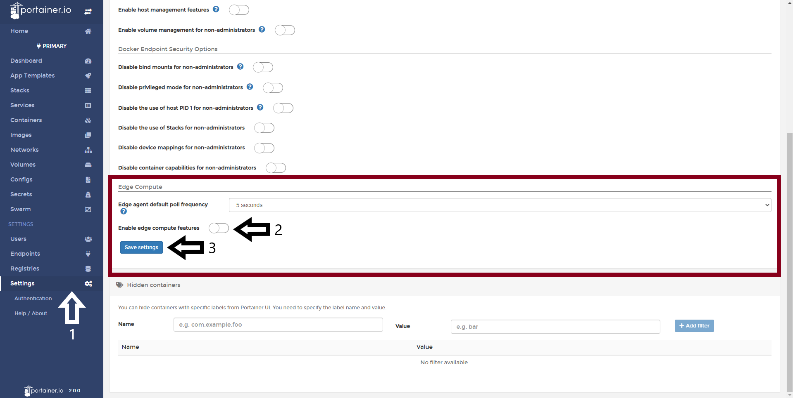
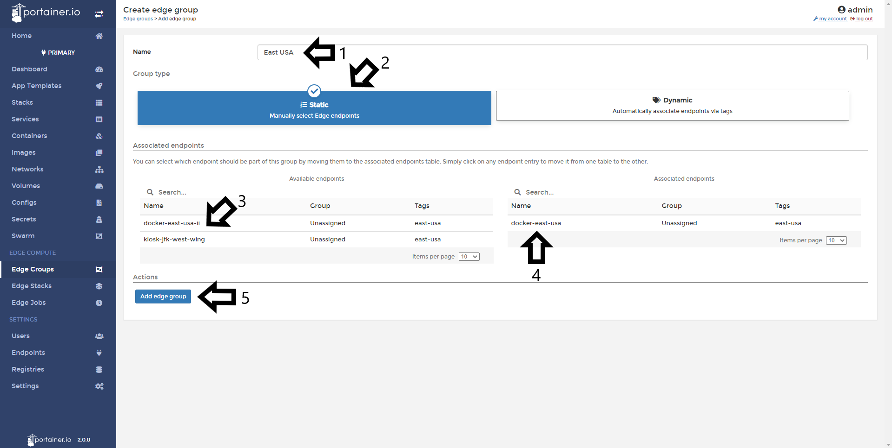
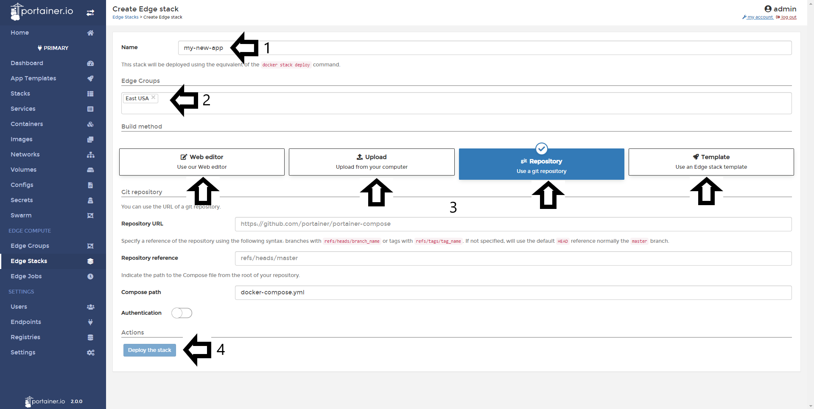

# Edge Compute features

In today’s world you can easily have hundreds - if not thousands - of Docker-enabled devices in your environment. Most of these systems run without any form of clustering or run a lean orchestrator such as Docker Swarm or Kubernetes.

Remote devices may be distributed across multiple sites and/or across many different networks, some may even be attached to the internet using mobile data or satellite. To be managed effectively, engineers need a way to control distributed instances centrally, which is exactly what Portainer does with Edge Computer Features.

## Enabling Edge Compute Features

To start to use this features, you need to enable from the Portainer Settings. 

Once you logged into Portainer, click in <b>Settings</b> and scroll down to <b>Edge Compute</b> section.

Enable the toogle and click in <b>Save Settings</b>

After that, you will see that a few options appears in the left column. 

Now, let's going to walktrough for that options in the following sections.

## Edge Groups

Edge Groups is a option that enable you to create groups of Edge endpoints based in a manual selection or in a dynamic way trough <b>tags</b>. This feature is very useful when you manage multiple Edge Endpoints in multiple zones.

To create a group, go to <b>Edge Groups</b> and then a clic in <b>Add Edge Group</b>.

Name the group and pick if you want to make a <b>Static</b> group type selecting Edge endpoints manually or choose Dynamic that automatically associate endpoints to that group trough determined tags.

If you choose <b>Static</b>. Select the Endpoints you want to add to that group and do a click in <b>Add edge group</b>.

If you choose <b>Dynamic</b> you can choose two options to match via <b>Tags</b> your Edge endpoints. 

* Partial Match: Associate any endpoint matching at least one of the selected tags. (Each endpoint can have multiple tags).
* Full Match: Associate any endpoint matching all of the selected tags.

Type the tag and endpoints with that tag will appear in the screen. After that do a click in <b>Add edge group</b>

## Edge Stacks

This feature is very powerful because can help you to deploy multiple applications to a multiple endpoints from a single screen and multiple sources.

To start using it. Click in <b>Edge Stacks</b> and then in <b>Add stack</b>.

The following step is name your stack and select an or several <b>Edge Groups</b>.

In the <b>Build Methond</b> you need to define how to deploy your app. Several options are available:

* Web Editor: You can use our web editor to write or paste a docker-compose file. 
* Upload: Upload a docker-compose.yml file from your computer
* Repository: Use a git repository where the compose file is. 
* Template: Use an Edge stack template. 

Once this set, do a click in <b>Deploy stack</b>

## Edge Jobs

This feature is useful to define task to run of multiple Edge endpoints, fox example, backup. 

Go to <b>Edge Jobs</b>, name your job and choose between the following two options:

* Basic Configuration: Select a date from a calendar
* Advanced Configuration: Write your own cron rule.

Select if this job is a recurring one and select the job time.

After that you can use our web editor to write or paste your script directly or upload from your computer. 

After that selecte in what endpoints you need to run this job and clic in <b>Create edge job</b>

## Notes

[Contribute to these docs](https://github.com/portainer/portainer-docs/blob/master/contributing.md).