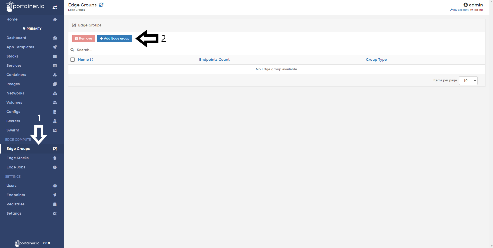

# Edge Compute features

In today’s world you can easily have hundreds - if not thousands - of Docker-enabled devices in your environment. Most of these systems run without any form of clustering or run a lean orchestrator such as Docker Swarm or Kubernetes.

Remote devices may be distributed across multiple sites and/or across many different networks, some may even be attached to the internet using mobile data or satellite. To be managed effectively, engineers need a way to control distributed instances centrally, which is exactly what Portainer does with Edge Computer Features.

## Enabling Edge Compute Features

First you must enable Edge Compute in the Portainer Settings.

1. Click <b>Settings</b> and scroll down to <b>Edge Compute</b> section.
 
2. Enable the toggle and 3. click <b>Save Settings</b>

After that, you will see that a few options appear in the side menu. 

## Edge Groups

Edge Groups allows you to create groups of Edge endpoints based on a manual selection or synamically through <b>tags</b>. This feature is very useful when you manage multiple Edge Endpoints in multiple zones.

To create a group, 1. go to <b>Edge Groups</b> and then 2. click <b>Add Edge Group</b>.

1. Enter a <b>Name</b> and then 2. select either <b>Static</b> or <b>Dynamic</b>.

### Static

3. Select the Endpoints you want to add to that group 4. These should then appear in the table on the right and finally 5. Click <b>Add edge group</b>

### Dynamic

3. If you choose <b>Dynamic</b> you must choose between two options to match via <b>Tags</b> your Edge endpoints:

* Partial Match: Associate any endpoint matching at least one of the selected tags. (Each endpoint can have multiple tags).
* Full Match: Associate any endpoint matching all of the selected tags.

4. Type the tag and endpoints with that tag will appear in the screen. Finally, click <b>Add edge group</b>

## Edge Stacks

This feature allows the deployment of multiple application to multiple endpoints from a single screen and multiple sources.

1. Select <b>Edge Stacks</b> and then 2. Click <b>Add stack</b>.

Next 1. <b>Name</b> your stack and 2. select one or more <b>Edge Groups</b>.

3. In the <b>Build Methond</b> you need to define how to deploy your app from one of these options:

* Web Editor: You can use our web editor to write or paste a docker-compose file. 
* Upload: Upload a docker-compose.yml file from your computer
* Repository: Use a git repository where the compose file is. 
* Template: Use an Edge stack template. 

4. Once complete, click <b>Deploy stack</b>

## Edge Jobs

This feature is useful to define a task to run on multiple Edge endpoints, for example, backup. 

Go to <b>Edge Jobs</b>.
Then 1. Name your job and 2. Choose between the following two options:

* Basic Configuration: Select a date from a calendar
* Advanced Configuration: Write your own cron rule.

3. Select if this job is a recurring job and enter the job time.

You can then use the web editor to write or paste the script. 

4. Select the target endpoints
5. To create and run the job click <b>Create edge job</b>

## Notes

[Contribute to these docs](https://github.com/portainer/portainer-docs/blob/master/contributing.md).