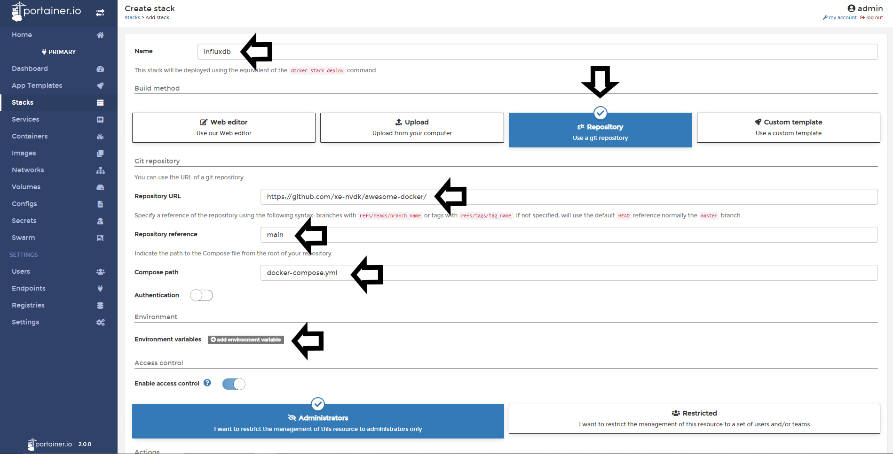

# How to create a new Stack

The Stacks are a collections of services running in a Docker Swarm environment. In this article, you will learn how to create a new stack. 

## Deploying a new stack

You can deploy a new stack from Portainer using the following options:

* Web editor: Using our Web Editor, you will capable to define the services for this stack using a docker-compose format. 
* Upload: If you're already have a stack.yml file, you can upload from your computer to deploy that stack.
* Git Repository: You can use a docker-compose format file hosted in Github.
* Custom Template: If you already created a template of stacks, you can deploy from this option. 

### Web Editor

To use our web editor, you need to clic in <b>Stacks</b>, name the stack, pick <b>Web Editor</b> and you can start to define your services using the editor. 

Also, you can define <b>Environment Variables</b> if you need. 

When you set up everything, do a click in <b>Deploy the Stack</b>.

### Uploading a stack file

In Portainer, you can create Stacks from compose YML files. To achieve this. Do a click in <b>Stacks</b>, click en <b>Add Stack</b>.

Name your new stack, pick <b>Upload</b> and choose your compose file from your computer, add environment variables if needed a do a click in <b>Deploy the Stack</b>.

### Deploy from Github Repository

If you have your compose file hosted in Github, you can deploy from there. Do a click in <b>Stacks</b>, then in <b>Add Stack</b>, pick <b>Git Repository</b>. 

Name your stack, and then, you need to define information about your Github repository:

* Repository URL: Here, you need to set the URL of your Github Repository.
* Repository Reference: Here, you need to define your branch.
* Compose Path: Here, you need to define the path to your compose file from the root of the repository.

If you need authenticate, define your user and password. <b>NOTE</b>: If you have a 2FA configured in Github, your passcode is your password. 

Set environment variables if needed and then, do a click <b>Deploy the Stack</b>.

## Notes

[Contribute to these docs](https://github.com/portainer/portainer-docs/blob/master/contributing.md).