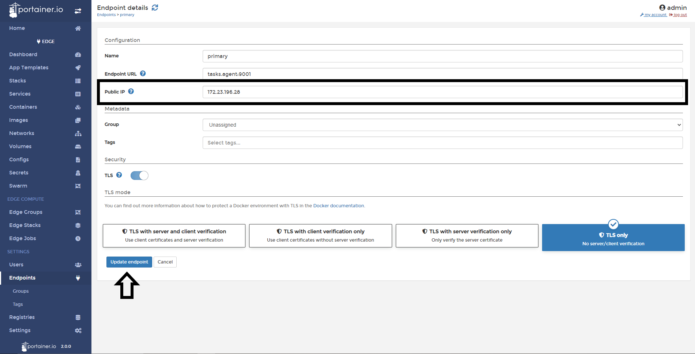

# Portainer Deployment Troubleshooting

If you are still experiencing issues after reading this FAQ, feel free to contact us via any one of the following channels:

* [Slack](https://portainer.slack.com/join/shared_invite/enQtNDk3ODQ5MjI2MjI4LTcwNGYxMWQ5OGViYWZkNDY2ZjY4YTMwMTgzYmU4YmNiOTU0MDcxYmJjNTIyYmQ0MTM5Y2QwNTg3NzNkMTk5MDg#/) for community support

* [GitHub](https://github.com/portainer) to log an issue if you've found a bug

* [Youtube](https://www.youtube.com/channel/UC7diMJcrULjDseq5yhSUZgg) for guided tutorials and updates

* [Portainer.io](https://www.portainer.io) or the contact us tool at the bottom right of screen

* Email [support@portainer.io](mailto:support@portainer.io)

## How do I reset my Portainer password?

You can ask another Portainer admin to reset the password for you, or alternatively if it is for the default admin account (from when Portainer was initialized), you can try our [password reset helper tool](https://github.com/portainer/helper-reset-password).

There is an open feature request to bring this functionality inside Portainer, which can be tracked on our [GitHub repository here](https://github.com/portainer/portainer/issues/512).

## Why does my version number not match the latest version?

If you have recently updated your version of Portainer, this usually indicates your browser has cached the page. To properly clear your cache, you will need to go into the browser settings and empty the cache.

Note: You can use Ctrl + Shift + R on most browsers to load the specific page without cache, however you will need to repeat this on each page of Portainer to load the changes.

Please also check you have pulled from the latest repo url. 

## Users have access to an endpoint, but they cannot see anything.

By default all resources inside an endpoint are assigned to administrator only for security reasons. To give non-admin users access you can use the access control widget within each resource to assign users ownership, or you can make the resource public to give all users access.

## Portainer lost it’s configuration, why?

Portainer as a Container: If you have not created a persistent volume for your Portainer container, then Portainer data will be stored inside the Docker container. If the container is then restarted, you will lose all of your data.

Portainer as a Service: If you have not created a persistent volume for your Portainer service, then Portainer data will be stored inside the Docker container created by the service. If the service is updated, you may lose your Portainer configuration.

See Deployment on how to create a persistent volume. If you have a persistent volume, then the issue may be that Portainer is not constrained to the node where the data is persisted. See the below section for more info.

## External endpoints are not working in the latest Portainer version, is this a bug?

We are aware that the <code>--external-endpoint</code> feature is not working in some of the latest versions of Portainer. If you require use of external endpoints, we recommend rolling back to Portainer version 1.21.0 until a fix has been released.

## My host is using SELinux, can I use Portainer?

If you want to manage a local Docker environment with SELinux enabled, you’ll need to pass the --privileged flag to the Docker run command when deploying Portainer:

<pre><code> docker run -d --privileged -p 9000:9000 -p 8000:8000 --name portainer --restart always -v /var/run/docker.sock:/var/run/docker.sock -v portainer_data:/data portainer/portainer-ce</code></pre>

You can also have a look at this [helper](https://github.com/dpw/selinux-dockersock.).

## How can I use Portainer behind a proxy?

With Portainer behind a proxy, some features requiring access to the Internet (such as Apps Templates) might be unavailable. When running Portainer as a container, you can set the HTTP_PROXY and HTTPS_PROXY env vars to specify which proxy should be used:

<pre><code> docker run -d -p 9000:9000 -p 8000:8000 -e HTTP_PROXY=my.proxy.domain:7777 portainer/portainer-ce</code></pre>

For examples on how to configure a reverse proxy to work with Portainer, you can refer to our example repo here.

Note: these are in no way production ready, and are intended solely for demonstration purposes.

## Exposed ports in the container view redirects me to 0.0.0.0, what can I do?

You can "fix" this in two ways. 

* In order for Portainer to be able to redirect you to your Docker host IP address and not the 0.0.0.0 address, you will have to change the configuration of your Docker daemon and add the --ip option. Note: that you will have to restart your Docker daemon for the changes to be taken in effect.

* <b>Recommended</b>: Go to <b>Endpoints</b>, select your endpoint and introduce the IP of the host in the field <b>Public IP</b>. Do a click in <b>Update Endpoint</b>.

## TLS Settings in local Kubernetes endpoint

We're addressing a bug in the endpoint details view of a Kubernetes endpoint, TLS settings, and information about Docker TLS is incorrectly shown. Changing the TLS settings does not affect.

The expected behavior is don't show TLS settings and Docker TLS message.

These options are no needed, and no make any effect in the configuration of local Kubernetes endpoints.

You can view more information about this bug and the progress for your resolution [here](https://github.com/portainer/portainer/issues/4316).

## Notes

[Contribute to these docs](https://github.com/portainer/portainer-docs/blob/master/contributing.md).
