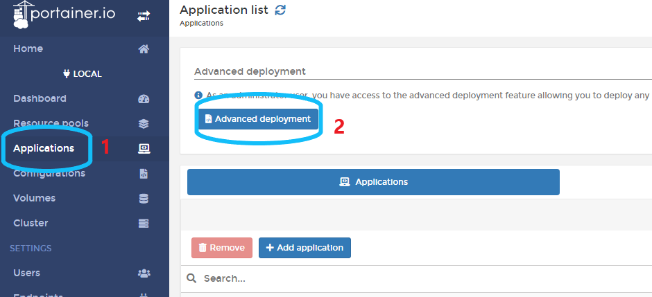

# Upgrade Kubernetes Deployment

Steps to upgrade Portainer and or Portainer agent deployed into Kubernetes. Upgrade method depends on the original install method used.

## Using Helm
Add Portianer helm repo running the following, ignore any warning about the repo being there already.
```shell
helm repo add portainer https://portainer.github.io/k8s/
```
```shell
helm repo update
```

Run the command below to upgrade to latest version of Portainer
```shell
helm upgrade -n portainer portainer portainer/portainer --reuse-values
```

<!-- #### For NodePort

Using the following command, Portainer will run in the port 30777

```shell
helm upgrade -n portainer portainer portainer/portainer
```

#### For Load Balancer

Using the following command, Portainer will run in the port 9000.

```shell 
helm upgrade -n portainer portainer portainer/portainer --set service.type=LoadBalancer
```

#### For Ingress

<pre><code> helm install -n portainer portainer portainer/portainer --set service.type=ClusterIP</code></pre> -->

## Using YAML Manifest

### Method 1:
Easiest way to upgrade is to use Portainer UI and use manifest files..

Copy the contents of manifest file from

#### For NodePort

```shell
https://raw.githubusercontent.com/portainer/k8s/master/deploy/manifests/portainer/portainer.yaml
```

> ##### Agent Only
>     https://raw.githubusercontent.com/portainer/k8s/master/deploy/manifests/agent/portainer-agent-k8s-nodeport.yaml

#### For LoadBalancer
```shell
https://raw.githubusercontent.com/portainer/k8s/master/deploy/manifests/portainer/portainer-lb.yaml
```

> ##### Agent Only
>     https://raw.githubusercontent.com/portainer/k8s/master/deploy/manifests/agent/portainer-agent-k8s-lb.yaml

Login to portainer, in Kubernetes endpoint where portainer is installed go to Applications --> Advanced Deployment. Paste the yaml content.




Paste the yaml content and click Deploy.
Portainer should come back to a login page in a few seconds.


### Method 2:

#### For NodePort
```shell
kubectl apply -n portainer -f https://raw.githubusercontent.com/portainer/k8s/master/deploy/manifests/portainer/portainer.yaml
```

#### For Load Balancer

```shell
kubectl apply -n portainer -f https://raw.githubusercontent.com/portainer/k8s/master/deploy/manifests/portainer/portainer-lb.yaml
```


Now you can go to portainer url and login. You should notice that the bottom left corner looks different than it did before. There is no more update nag and the version is no longer shown next to the Portainer logo.

## Notes
[Contribute to these docs](https://github.com/portainer/portainer-docs/blob/master/contributing.md).
